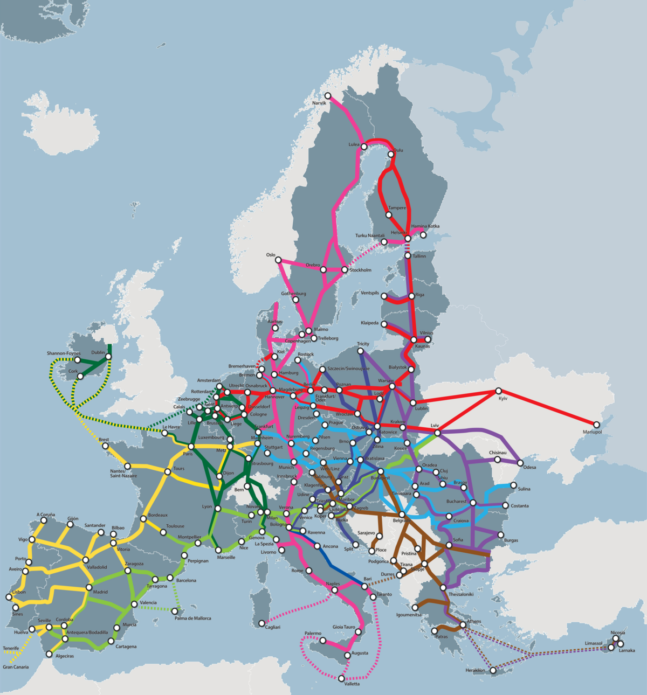
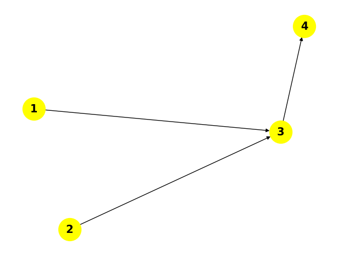

# UrbanFlow 🚦



Dive into the **UrbanFlow** project! This tool, built with Python, explores city transportation networks using directed graphs—nodes as locations and edges as paths (one-way or two-way). It tracks every possible route between points and counts how often each connection is used, pinpointing the most critical links. 📊

## Quick Guide
- [What’s Inside](#whats-inside)
- [What It Does](#what-it-does)
- [Getting Started](#getting-started)
- [How to Use](#how-to-use)
- [Sample Results](#sample-results)
- [Join In](#join-in)
- [Terms of Use](#terms-of-use)
- [Get in Touch](#get-in-touch)

## What’s Inside

This project now includes:

- **Python package** (`urbanflow`) to work with directed transport networks:
  - Draws the network with `networkx` and `matplotlib`.
  - Figures out all routes between any two points.
  - Tallies up how often each link appears to spot key connections.
  - Builds an OD–edge incidence matrix.
  - Saves results as DataFrames and exports them to CSV, Excel, and text files.
- **CLI tool** (`python -m urbanflow.cli`) to run the full analysis from a CSV edge list.
- **Demo Notebook** (`UrbanFlow_demo.ipynb`) to show the Python API on a toy network.

It’s powered by Python and uses libraries like `pandas`, `networkx`, `matplotlib`, and `numpy`.

## What It Does

- 📈 **Network View**: Shows the transport map with labeled spots and directed lines.
- 🛤️ **Route Tracking**: Lists every possible path between locations.
- 🔍 **Link Priority**: Highlights which connections get used the most.
- 💾 **File Output**: Dumps results into CSV, Excel, and text files.
- 🚀 **User-Friendly**: Use it as a Python module, from the CLI, or via a Jupyter Notebook demo.

## Getting Started

To run this on your machine, try these steps:

1. **Grab the Code**:
   ```bash
   git clone https://github.com/Fardinmilani/UrbanFlow.git
   cd UrbanFlow
   ```

2. **Install What You Need**:
   Make sure Python 3.11+ is ready. Then, install the dependencies:
   ```bash
   pip install -r requirements.txt
   ```

3. **(Optional) Set Up Jupyter**:
   If you don’t have Jupyter, add it:
   ```bash
   pip install jupyter
   ```

4. **(Optional) Launch the Demo Notebook**:
   Start Jupyter Notebook and open `UrbanFlow_demo.ipynb`:
   ```bash
   jupyter notebook
   ```

5. **Run the CLI on Your Own Network**:
   Prepare a CSV file with at least two columns: `from`, `to` (each row is a directed edge).

   Then run:

   ```bash
   python -m urbanflow.cli path/to/edges.csv --output-dir my_output
   ```

   This will generate:
   - `urbanflow_edge_usage.csv`
   - `urbanflow_od_incidence.csv`
   - `urbanflow_results.xlsx`
   - `urbanflow_network.png`

## How to Use

### Use as a Python module

You can import `urbanflow` in any Python script or notebook:

```python
from urbanflow import analyze_network, save_analysis_results

graph = {
    "1": ["3"],
    "2": ["3"],
    "3": ["4", "4"],  # two parallel links 3->4
    "4": [],
}

result = analyze_network(graph)
save_analysis_results(result, output_dir="urbanflow_output", base_name="urbanflow_demo")
```

### Use via CLI

```bash
python -m urbanflow.cli edges.csv --output-dir analysis_out
```

This reads `edges.csv`, runs the analysis, and writes outputs to the `analysis_out` folder.

## Sample Results

Here’s a peek at the network visualization:



You’ll get:
- A full list of paths between nodes.
- A table of link usage and an OD–edge incidence matrix, saved as:
  - `urbanflow_edge_usage.csv`
  - `urbanflow_od_incidence.csv`
  - `urbanflow_results.xlsx`

## Join In

Love to contribute? 🌟 Here’s how:
1. Fork this repo.
2. Start a new branch (`git checkout -b feature/your-feature`).
3. Make your changes and commit (`git commit -m "Add your feature"`).
4. Push it (`git push origin feature/your-feature`).
5. Send a pull request.

Keep the code tidy and add comments where needed.

## Terms of Use

This work is under the MIT License. Check the [LICENSE](LICENSE) file for the full story.

## Get in Touch

Got ideas or questions? Drop a line! 📬
- GitHub: [Fardinmilani](https://github.com/Fardinmilani)
- Email: fardin.milani.user@gmail.com

---

Give it a ⭐ if it helps!  
Enjoy exploring urban routes! 🚍